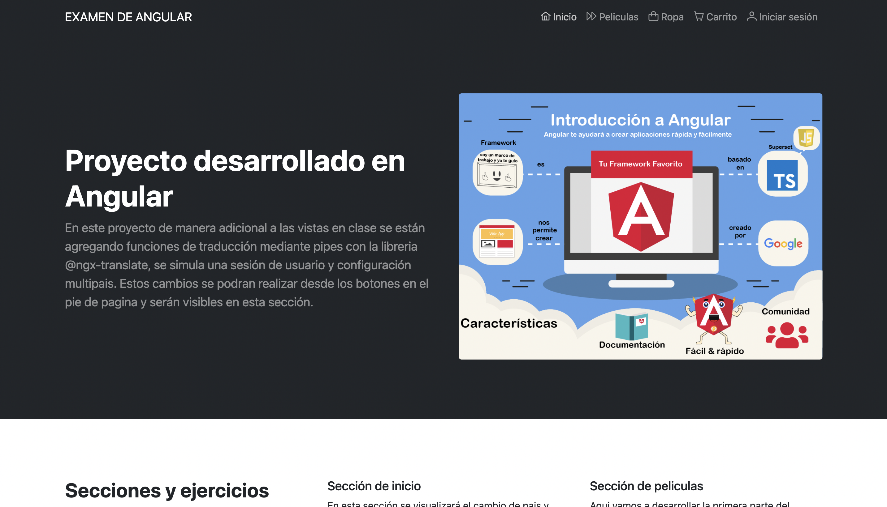
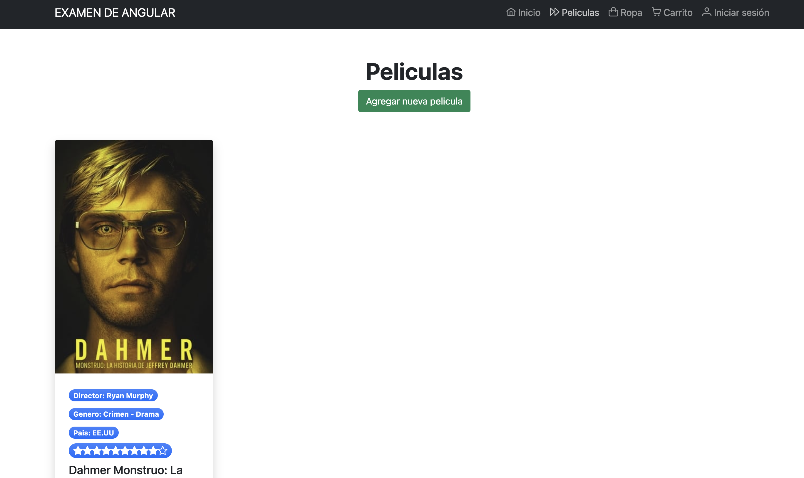
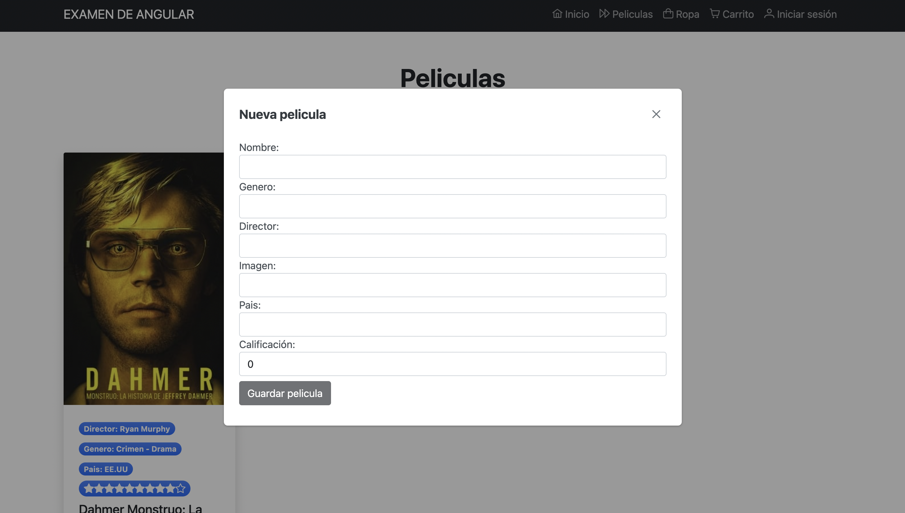
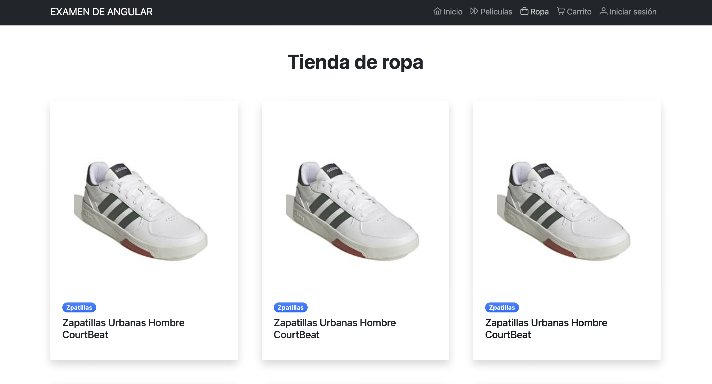
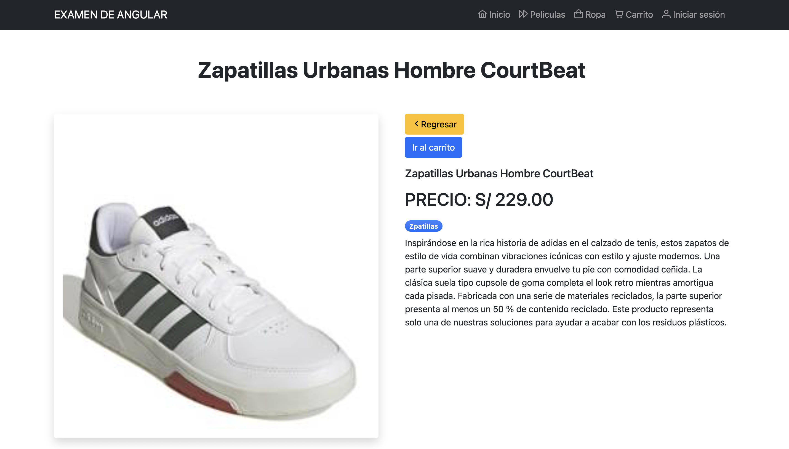
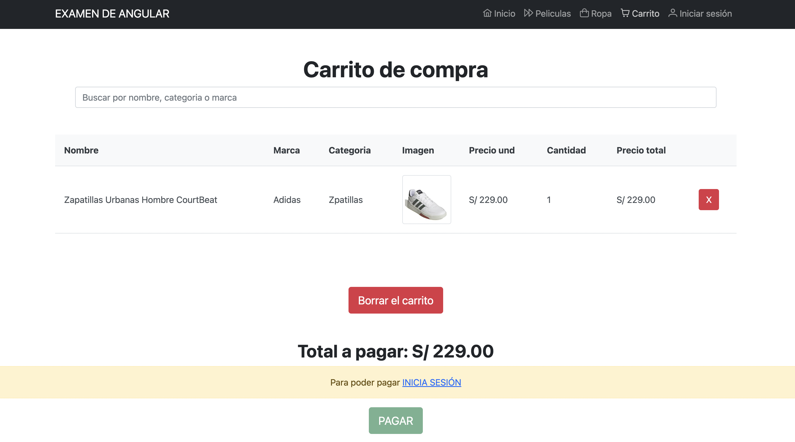

# Examen Final Java Front Cibertec

This project was generated with [Angular CLI](https://github.com/angular/angular-cli) version 14.2.6.

## Preguntas del examen

1. Listado de peliculas: Listar, Agregar y eliminar. Con API SERVER en json server
2. Listado de productos de vestir: Listar y ver detalle. Con API SERVER en json server
3. Realizar una busqueda con pipes customizados
4. Pregunta teorica
    - Respuesta

## Screenshots del sistema
- Página de inicio: Aqui se ingreso el modulo de traducción por pipes

- Página de peliculas: Resolución de la pregunta 1 del examen

- Página de peliculas: Resolución de la pregunta 1 del examen

- Página de peliculas: Resolución de la pregunta 2 del examen

- Página de peliculas: Resolución de la pregunta 2 del examen

- Página de peliculas: Resolución de la pregunta 3 del examen

## Development server

Run `ng serve` for a dev server. Navigate to `http://localhost:4200/`. The application will automatically reload if you change any of the source files.

## Code scaffolding

Run `ng generate component component-name` to generate a new component. You can also use `ng generate directive|pipe|service|class|guard|interface|enum|module`.

## Build

Run `ng build` to build the project. The build artifacts will be stored in the `dist/` directory.

## Running unit tests

Run `ng test` to execute the unit tests via [Karma](https://karma-runner.github.io).

## Running end-to-end tests

Run `ng e2e` to execute the end-to-end tests via a platform of your choice. To use this command, you need to first add a package that implements end-to-end testing capabilities.

## Further help

To get more help on the Angular CLI use `ng help` or go check out the [Angular CLI Overview and Command Reference](https://angular.io/cli) page.
